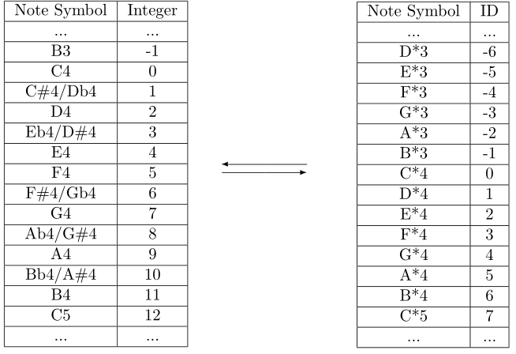

# mathmusic_macro

A macro package for simplification of composition on Mathematica

## USER MANUAL

For tonal modifying operation, numbers are more convenient than note symbols in Mathematica. There is a one-to-one correspondence between notes and integers shown as the left form below.

12-note scheme presents all the notes in absolute format which is unfriendly to us, while people are used to 7 notes from `C` to `B` once the tonality is fixed. The key is to find a map g from 7-note scheme to 12-note scheme so that people can operate in convenient way.

We show inputting formats of different effects in the form below.

With these rules, we can get a concise format of notes.

We save those notes as vectors, let the computer to estimate their types with the accordance of their inputting formats.

At this time, we can change this score paragraph into whichever tonality you want by replacing the first and the second variate in the function. And you can move the whole song up or down by altering the third variable. But this is still limit for those songs within parts in different tonalities. So, I tried to expend the song vector, let them hold not only one paragraph and the information of each paragraph was previously reserved. The new format of the song is like this.

The information includes the tonality of the paragraph(major or minor and central note), the offset of the paragraph and the speed while paragraph itself contains notes. I took advantage of this occasion, added some new properties such as volume and volume gradient.

The volume linearly decreases with notes. Information part temporarily contains these properties, its input format follows the rules below.

For more details, please refer to the demo code `Demo_BWV-1079.nb`.